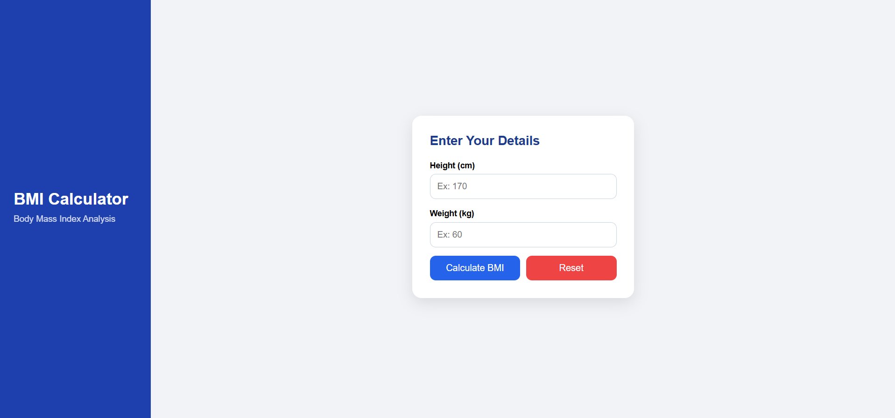
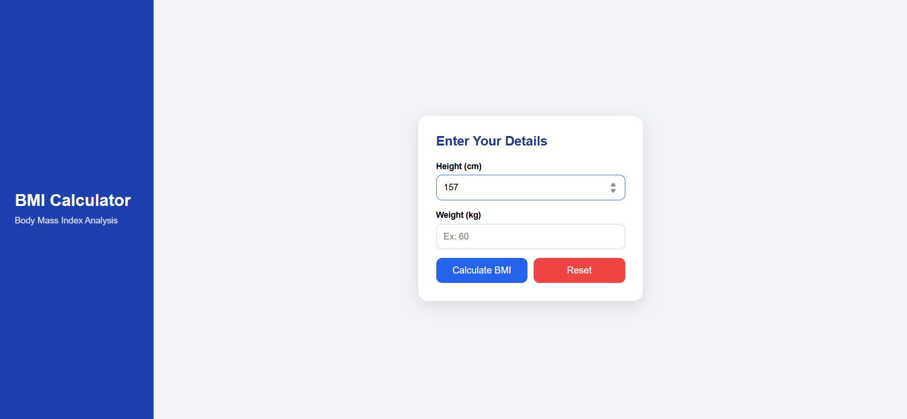
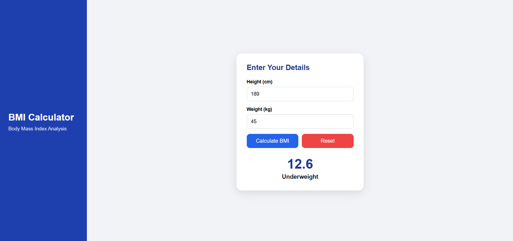
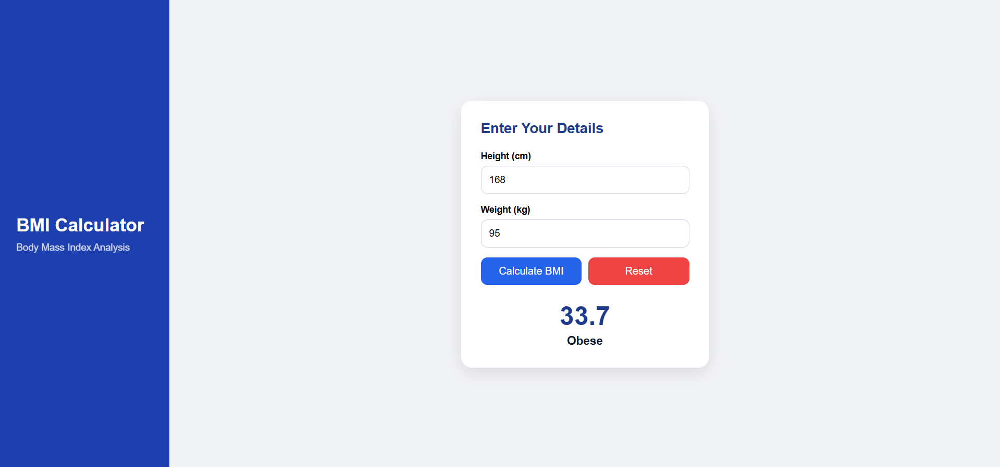

**Main Page**

**Enter Height**

**Enter Weight**

**Click on Calculate BMI button**
For normal category

For Underweight category

For Overweight category

For Obese category

**Click on Reset button**

## BMI Calculator – React Project

A simple and interactive BMI (Body Mass Index) Calculator built using React, demonstrating the concepts of state management and forms.

**Project Overview**

This BMI Calculator allows users to:

Enter height (in cm)

Enter weight (in kg)

Calculate their BMI

View the BMI category (Underweight, Normal, Overweight, Obese)

Reset all input fields and results

This project is ideal for beginners to understand useState, form handling, conditional rendering, and basic UI structure.

**Concepts Covered**

React useState

Controlled input fields

Form handling

Conditional rendering

Component layout & CSS styling

**Features**

✔ Enter Height & Weight
✔ Calculate BMI instantly
✔ Displays BMI Value
✔ Displays Status (Normal, Overweight, etc.)
✔ Reset Button to clear all data
✔ Clean & responsive UI
✔ Sidebar + Card Layout

**UI Layout**

The app layout includes:

A left sidebar (title + subtitle)

A center card for BMI inputs & results

Two buttons:

Calculate BMI

Reset

**How to Run the Project**
1. Install dependencies
npm install

2. Start development server
npm run dev

3. Open in browser

Visit:

http://localhost:5173/

**Project Structure**

/bmi-calculator
│── src
│   ├── App.jsx
│   ├── App.css
|   ├── Calculator.jsx
│   └── main.jsx
│
└── index.html

**BMI Formula**
BMI = weight (kg) / (height (m) × height (m))

BMI Categories:
BMI Range	Category
< 18.5	Underweight
18.5–24.9	Normal
25–29.9	Overweight
30+	Obese

**Technologies**

React (Vite)

JavaScript (ES6+)

CSS (Custom Styling)

**Future Improvements**

Add animations

Add BMI chart

Add color-coded results

Add history of calculations
