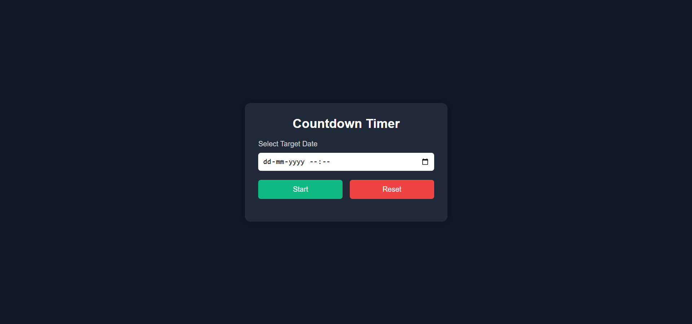
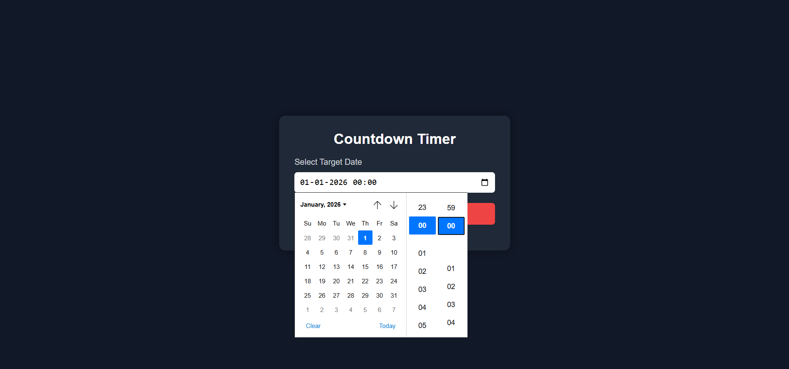
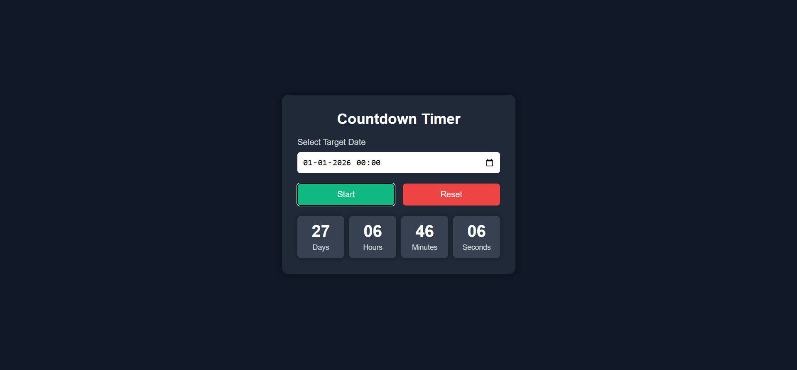
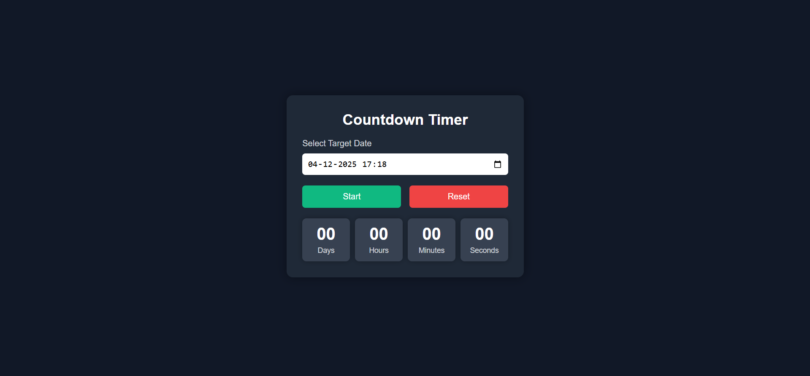

**Main Page**

**Select Date/Time**

**Click on start button to start countdown**

**Click on Reset Button**

**When Timer Reaches Zero**

## Countdown Timer (React)

A simple and modern Countdown Timer built using React, demonstrating the usage of:

useState

useEffect

Handling date/time inputs

Conditional rendering

Live countdown updates

**Features**

✔ Select a target date & time
✔ Live countdown showing days, hours, minutes, seconds
✔ Start and Reset buttons
✔ Automatically stops when countdown reaches zero
✔ Nice dark theme UI
✔ Responsive layout

**Technologies Used**

React (Vite)

JavaScript

CSS (Custom styling)

Hooks (useState, useEffect)

**Project Setup**

**1.** Create React + Vite Project
npm create vite@latest countdown-timer -- --template react

**2.** Install dependencies
cd countdown-timer
npm install

**3.** Start development server
npm run dev

**File Structure**
/src
│── App.jsx       
│── App.css              # Styling
|── CountdownTimer.jsx   # Main countdown logic
│── main.jsx
│── index.html

**How It Works**

**1.** User selects a date/time

Using <input type="datetime-local">, user picks a future target date.

**2.** Start button

Starts the countdown by enabling a timer using setInterval.

**3.** Countdown calculation

Difference between the target date and current time:

difference = targetDate - now

Converted into:

days

hours

minutes

seconds

**4.** When timer reaches zero

The countdown stops automatically.

**5.** Reset button

Clears all values and stops the timer.

**UI Preview (Dark Theme)**

- Clean card layout

- Green start button

- Red reset button

- Glowing boxes for time units

- Modern professional look
