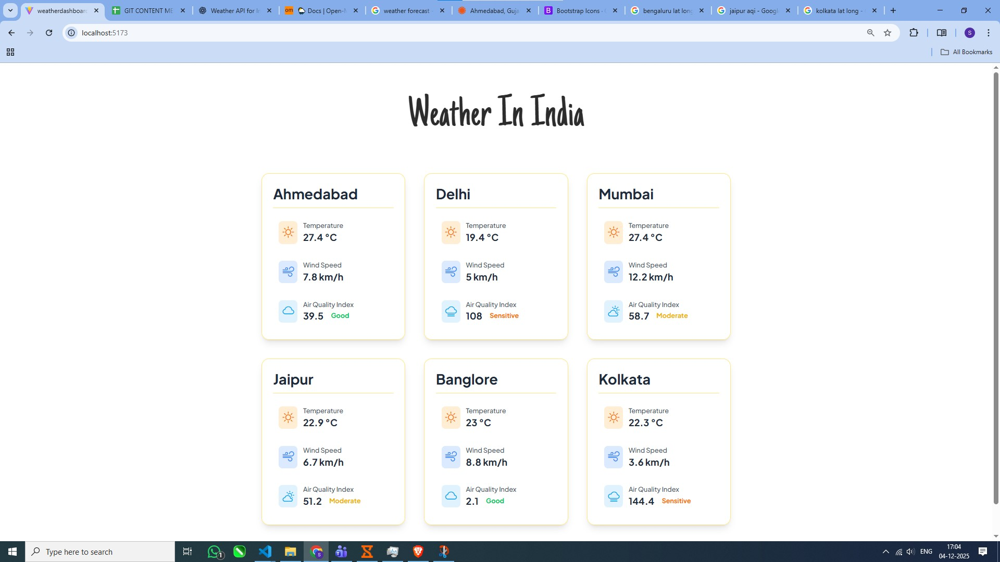

<h1 align="center">Weather Dashboard</h1>

## API Used : 
- Weather API: https://api.open-meteo.com/v1/forecast  
- Air Quality API: https://air-quality-api.open-meteo.com/v1/air-quality

## Commands to run:
- npm install  
- npm install tailwindcss @tailwindcss/vite  
- npm run dev

## Functionality:
- Show city Temperature, Wind Speed and AQI

